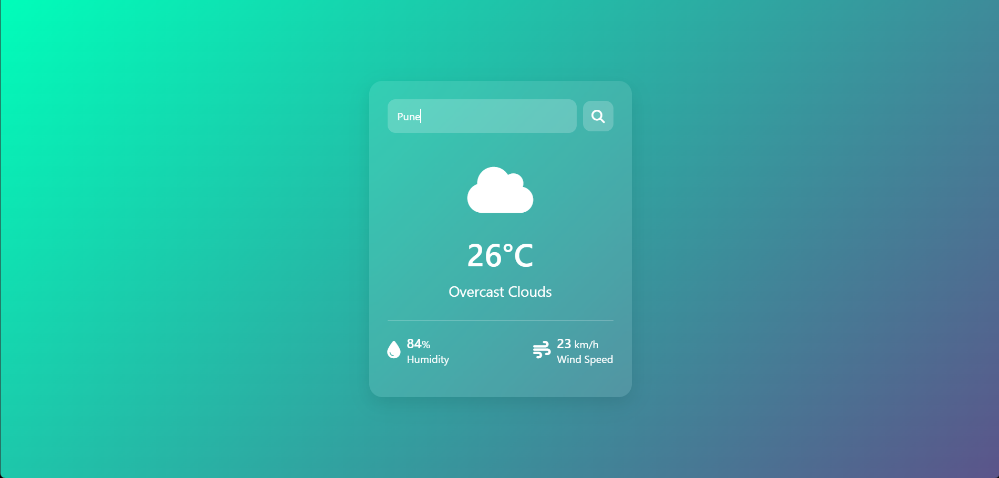

# 🌦️ Weather App

A responsive and lightweight weather application built using **HTML**, **CSS**, and **JavaScript**. It fetches real-time weather data using the **OpenWeatherMap API** and displays the temperature, weather condition, humidity, and more for any city.

---

## ✨ Screenshot

---

## 📋 Features

- 🌍 Search weather by city name
- 🌡️ Displays temperature, humidity, wind speed, and conditions
- 🎨 Simple and clean UI using CSS
- ⚙️ API integration using Fetch and async JavaScript

---
